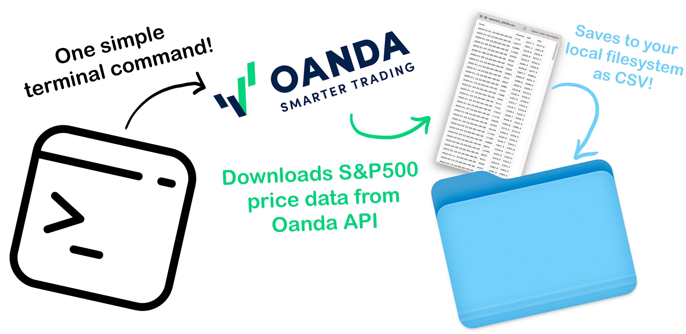
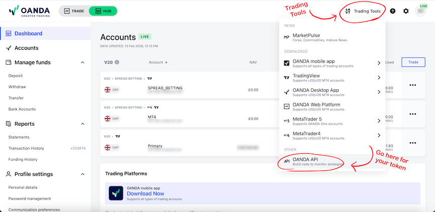
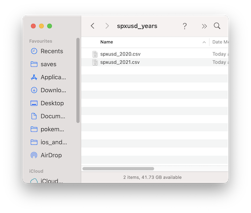

# Oanda Price Collector

### Easily download daily S&P500 price data from the Oanda API! 📈



## What's Included 🤩
- Command-line tool that runs with a single, easy command ✨
- Daily bid, ask, and volume data for S&P500 saved as CSV 📊
- Specify any date range starting from *2003-03-23* all the way to today's date 🗓️

## Environment Setup 🔧
This project is designed for **Python Version 3.14.3** 🐍

Set up a virtual environment of your choice (`conda`, `venv`, `poetry`, etc.), and simply run `pip install -r requirements.txt` to install all required dependencies.

You will need to make sure to set a couple of **environment variables** so you can authenticate to the API. See the **"API Authentication"** section for more info.

## API Authentication 🔐

You will need an **Oanda Trading Account** in order to have access to the API (free to set up).

Once you've made an account, you'll only need *2 things* to get started - your **Account ID**, and a **Personal Access Token**.

### Account ID:
You can find your **Account ID** by going to your **Dashboard**, and looking at the small grey number under one of your **Accounts**:


It's recommended you use the Account ID for the account labelled **"Primary"**.

### Personal Access Token:
You can get your **Personal Access Token** by selecting **"Trading Tools"** in the top-right, and selecting **"Oanda API":**



### Environment Variables:
Once you've got your *Account ID* and *Personal Access Token*, you'll need to make sure they are set as environment variables in your terminal. 
The recommended way to do this is to add the following to your `.bashrc` (or `.zshrc` if using `zsh`):
```
export OANDA_ACCOUNT_ID=>>YOUR_ACCOUNT_ID<<
export OANDA_API_TOKEN=>>YOUR_PERSONAL_ACCESS_TOKEN<<
```

⚠️ **Important!** Make sure you've set up a **trading account**, not a **demo account**, otherwise your credentials will not be valid.


## How To Use 📑
In your terminal run `python main.py --start_date >>YOUR_START_DATE<< --end_date >>YOUR_END_DATE<< `, passing in the start- and end-dates you'd like to download S&P500 data for.

Your dates **must** be in YYYY-MM-DD format.

For example, to pull data from 2020-01-01 to 2021-02-15 you'd run:
```
python main.py --start_date 2020-01-01 --end_date 2021-02-15
```

The data you've requested will be saved to the `spxusd_years/` folder in CSV format; separated into one file per year:



That's all, enjoy the app! 😁 


